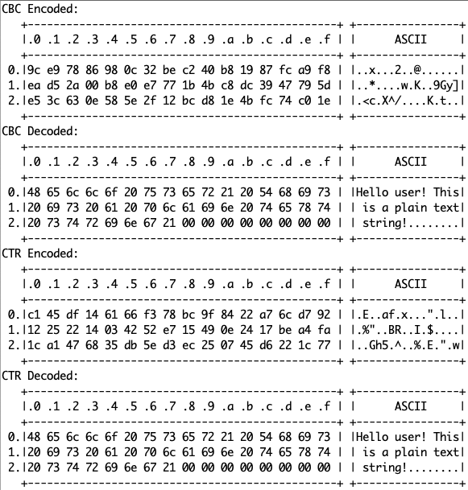
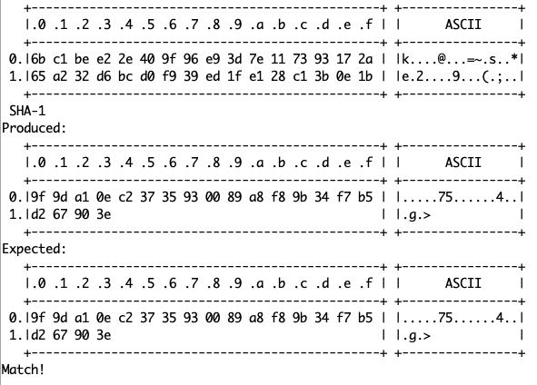

# RUI3_nRFCrypto_AES

An RUI3 port of the Adafruit nRFCrypto library, and more specifically of [my fork](https://github.com/Kongduino/Adafruit_nRFCrypto). Since RUI3 is a bare metal platform, without RTOS, the library cannot work as is, so I had to hack things apart, and put them back together. So far I have implemented `nRFCrypto_Random`, an existing class from the library, and `nRFCrypto_AES`, my own addition to the library, which provides hardware-accelerated AES encryption and decryption, ECB, CBC and CTR.

The sample code demonstrates AES encryption for nRF52840 devices (here specifically RAK4631 using RUI3), while using `nRFCrypto_Random` for the key and IV. I have also added `nRFCrypto_Hash` to the example, using the example code from Adafruit.

TODO: round it up with HMAC.

